# 📦 Last-Mile Delivery System – Architecture & Design

## 🧭 Overview

This system facilitates on-demand deliveries with real-time tracking, service selection, automated rider matching, and M-PESA payouts. It serves end-users requesting deliveries and drivers fulfilling them.

---

## 🧱 Project Initialization (Docker-Based Setup)

### 🗂️ Folder Structure

```text
lastmile-delivery/
├── apps/
│   ├── frontend/        # SvelteKit app
│   └── backend/         # NestJS API server
├── prisma/              # Prisma schema & migrations
├── docker-compose.yml   # Compose setup
├── .env                 # Shared environment vars
└── README.md
```

### 🐳 Docker Setup

#### `apps/frontend/Dockerfile`

```Dockerfile
FROM node:20-alpine
WORKDIR /app
COPY . .
RUN npm install && npm run build
EXPOSE 5173
CMD ["npm", "run", "preview"]
```

#### `apps/backend/Dockerfile`

```Dockerfile
FROM node:20-alpine
WORKDIR /app
COPY . .
RUN npm install && npm run build
EXPOSE 3000
CMD ["npm", "run", "start:prod"]
```

#### `docker-compose.yml`

```yaml
version: '3.8'

services:
  frontend:
    build: ./apps/frontend
    ports:
      - "5173:5173"
    environment:
      - VITE_BACKEND_URL=http://localhost:3000
    depends_on:
      - backend

  backend:
    build: ./apps/backend
    ports:
      - "3000:3000"
    environment:
      - DATABASE_URL=postgresql://postgres:postgres@db:5432/lastmile
      - JWT_SECRET=supersecret
    depends_on:
      - db

  db:
    image: postgres:15
    restart: always
    ports:
      - "5432:5432"
    environment:
      POSTGRES_USER: postgres
      POSTGRES_PASSWORD: postgres
      POSTGRES_DB: lastmile
    volumes:
      - pgdata:/var/lib/postgresql/data

volumes:
  pgdata:
```

### 🚀 Quick Start

```bash
docker-compose up --build
```

Access:

* Frontend: [http://localhost:5173](http://localhost:5173)
* Backend: [http://localhost:3000](http://localhost:3000)

---

## 🧩 Split Sequence Flows by User Stories

### 🧑‍💼 User Login Flow

**Goal:** Authenticate a user and issue a JWT token.

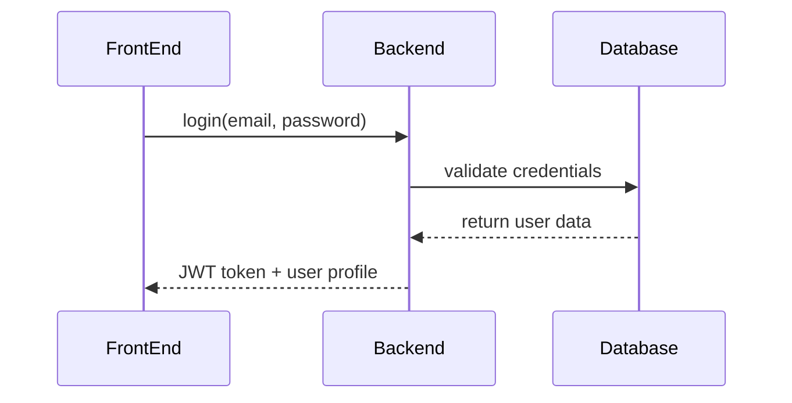

---

### 📍 Initiate Delivery & Show Options

**Goal:** User provides pickup/dropoff and gets service type and cost options.

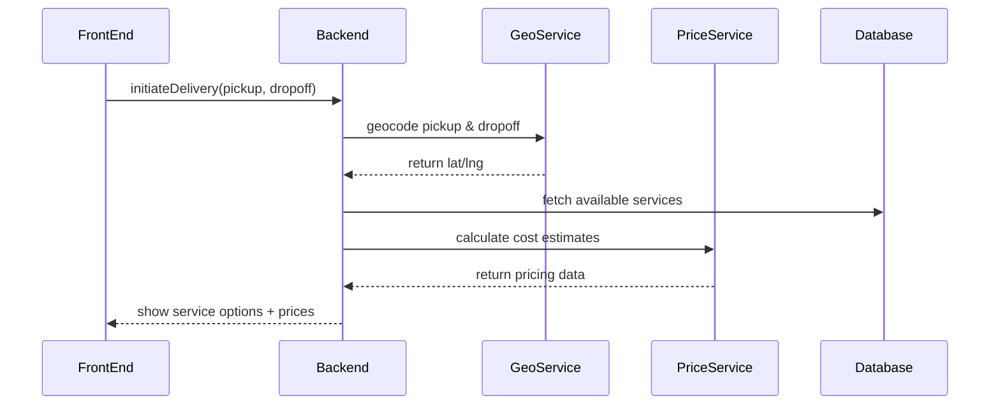

---

### 🚴‍♂️ Confirm Delivery & Assign Driver

**Goal:** User selects an option, driver accepts, and ETA is shared.

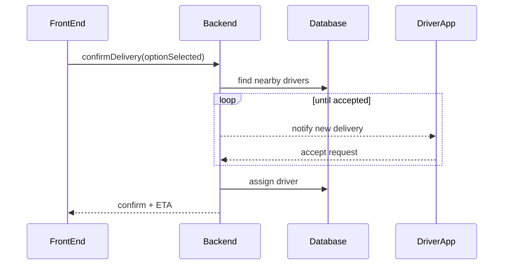

---

### 💳 Authorize Payment

**Goal:** Reserve payment for trip prior to driver assignment.

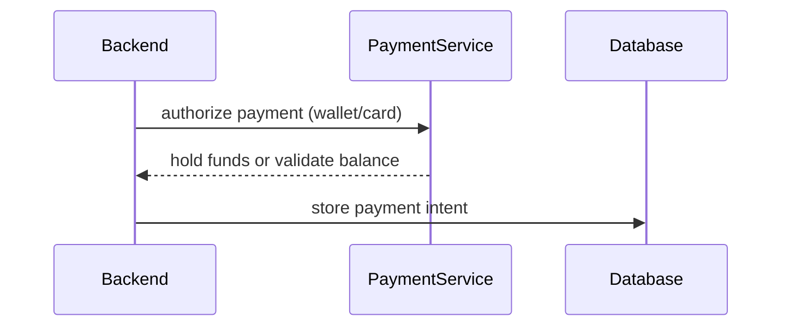

---

### 🛰️ Real-Time Tracking

**Goal:** Update client every 10s with live driver location.

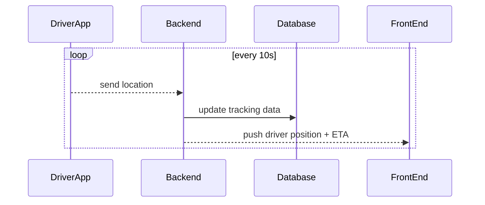

---

### 🔔 Notifications (Pickup & Pre-dropoff)

**Goal:** Inform the user of key delivery milestones.

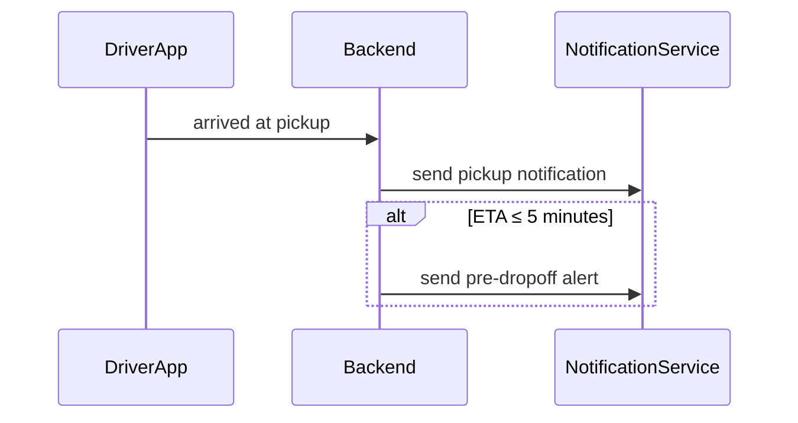

---

### 📦 Delivery Confirmation & Completion

**Goal:** Mark delivery complete and process payment.

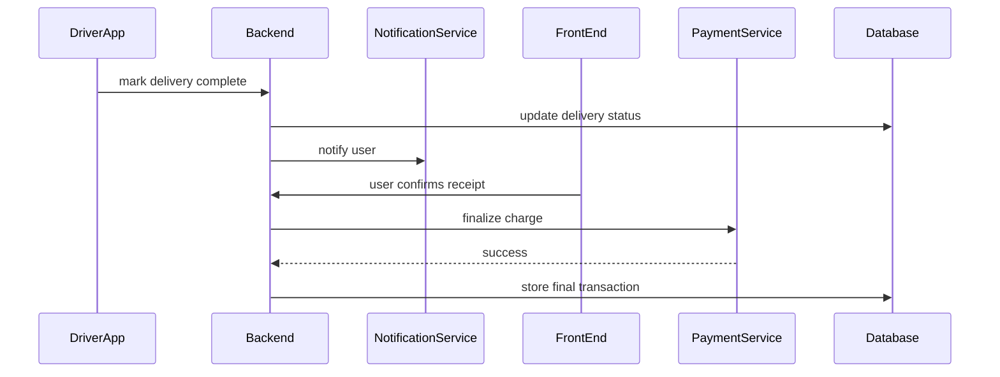

---

### 💸 Rider Payout via Daraja API

**Goal:** Pay driver via M-PESA or track cash collection.

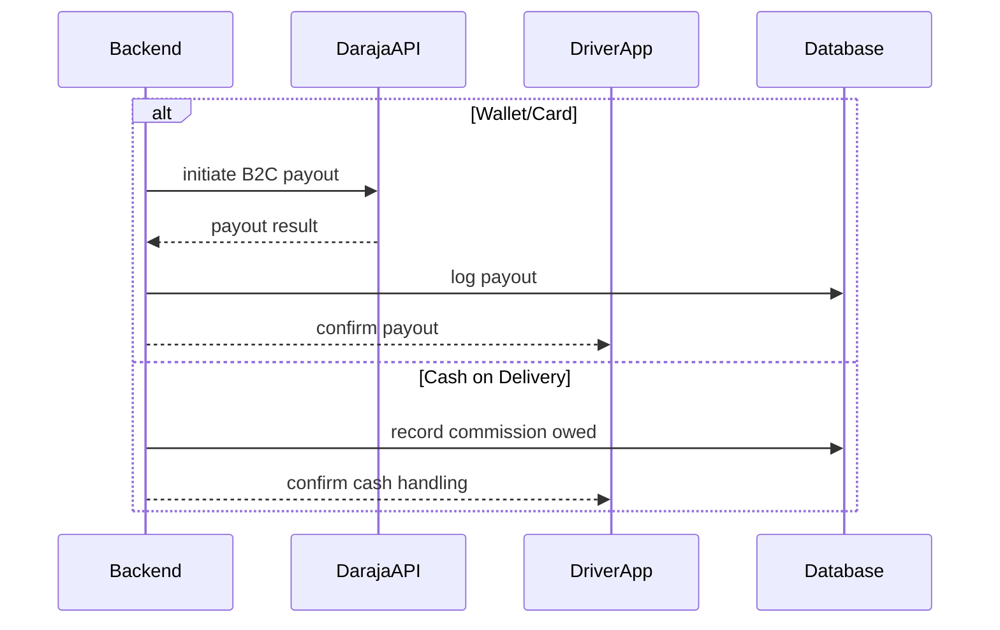

---

## 🔁 Flow Diagrams per User Story

### 1. Login Flow

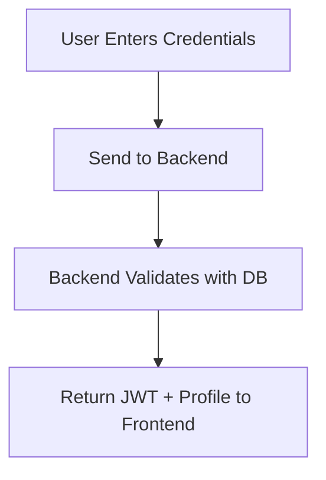

### 2. Delivery Option Flow

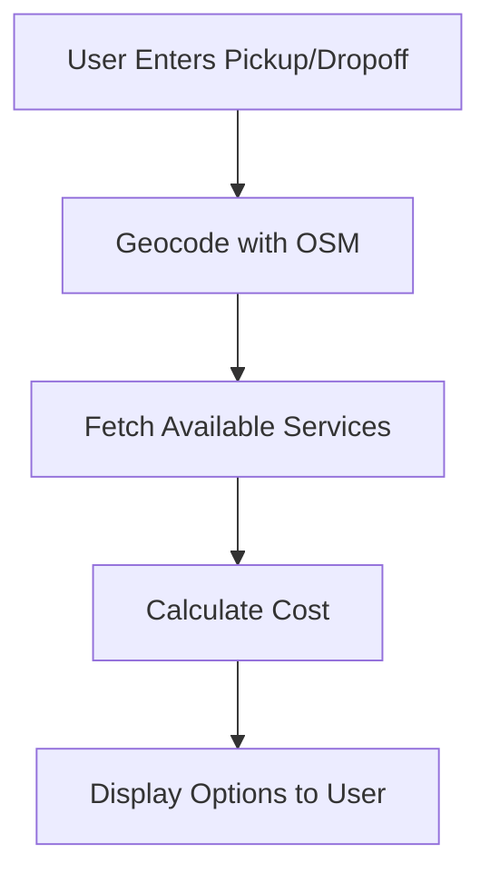

### 3. Rider Matching

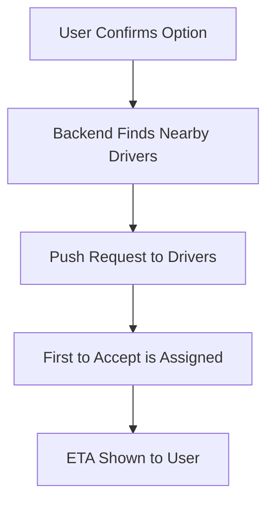

### 4. Real-Time Tracking

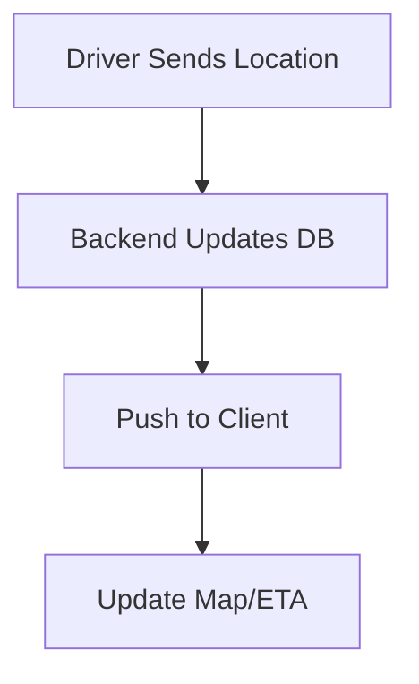

### 5. Notifications

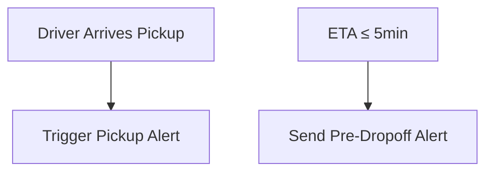

### 6. Completion & Payment

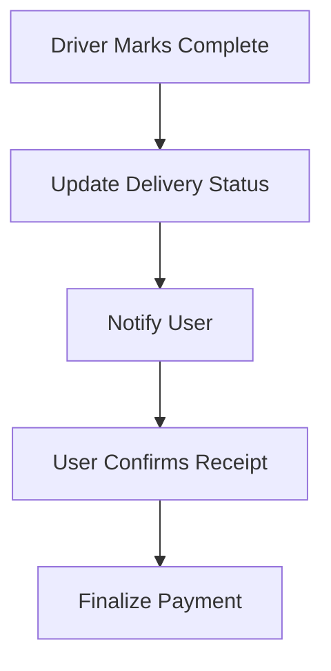

### 7. Rider Payout (Daraja)

```mermaid
graph TD
    A[Payment Successful] --> B[Trigger Daraja B2C]
    B --> C[MPESA API Response]
    C --> D[Log & Notify Driver]
    alt Cash on Delivery
        A2[COD Recorded] --> E[Mark Commission Owed]
        E --> F[Notify Driver of Cash Handling]
```
